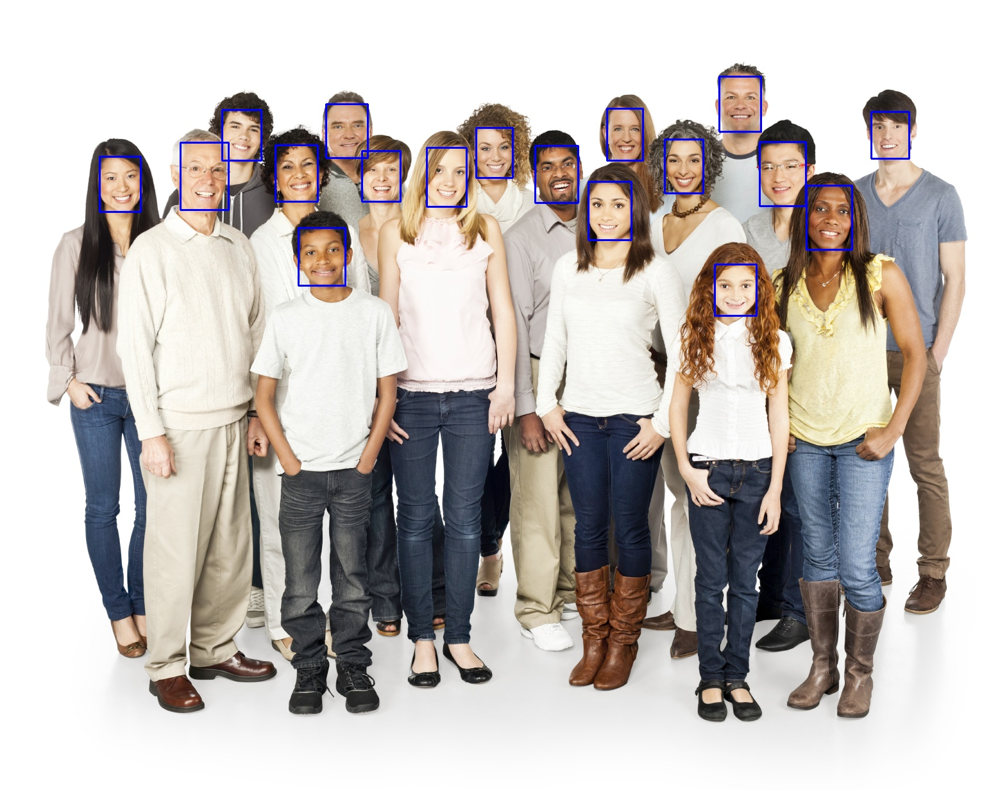

# Face Detection Web Application

## Overview:
This project is a web application that allows users to upload images and detect faces within those images using a robust face detection algorithm.

# Tools Used:

Framework: Flask for web application development.
Computer Vision: OpenCV for image processing.
Face Detection: MTCNN (Multi-Task Cascaded Convolutional Networks) for detecting faces in images.
# Key Features:

File Upload: Users can upload images in various formats (PNG, JPG, JPEG, GIF).
Face Detection: The application detects faces in the uploaded images using the MTCNN model.
Image Processing: Detected faces are highlighted with rectangles using OpenCV.
Result Display: Processed images with detected faces are saved and displayed on a separate page for the user to view and download.
# Challenges and Solutions:

### Suppressing TensorFlow Logging:
Suppressed TensorFlow INFO and WARNING messages to ensure a clean output by setting the environment variable TF_CPP_MIN_LOG_LEVEL.
File Security: Ensured secure file handling by using werkzeug.utils.secure_filename to avoid any potential security risks with file uploads.
Directory Management: Created and managed an upload directory dynamically using os.makedirs to ensure the folder exists and is ready for storing uploaded files.
### Impact:
This project provides a simple and effective way for users to perform face detection on their images without needing to understand complex computer vision algorithms. It demonstrates the practical application of integrating face detection models into web applications and showcases the use of various Python libraries and frameworks in creating a seamless user experience.
