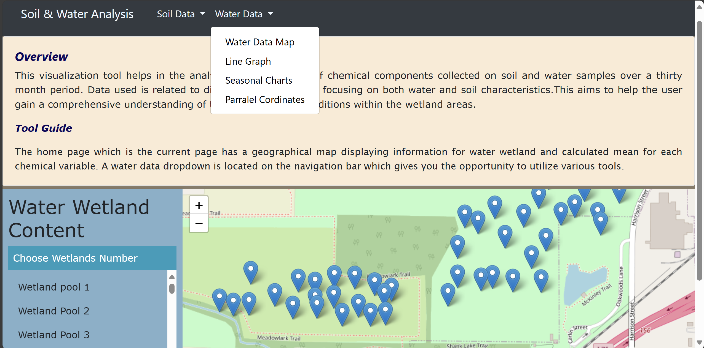
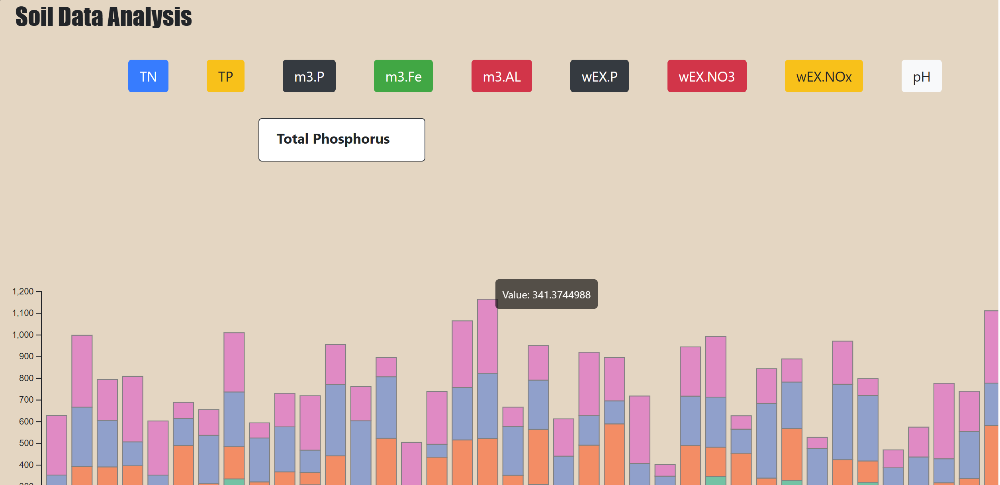

# Soil and Water Analysis Visualization Tool

## Overview
This project involves creating visualizations for water and soil datasets acquired from field readings. The goal is to facilitate exploration and analysis of scientific experiment data related to soil and water dynamics. The intended audience for this visualization tool includes domain experts such as professors and graduate students. The tool features interactive visualizations that display chemical values on a leaf map, along with seasonal data represented in a bar chart format.

## Features
- Interactive leaf map showcasing chemical values from soil and water analysis.
- Seasonal data visualized in bar charts for easy comparison.
- User-friendly interface for seamless navigation through datasets.
- Detailed insights into soil and water dynamics based on field readings.
  

## Usage
To view the project, navigate to the following link: [Soil and Water Analysis Visualization Tool](https://kianakiashemshaki.github.io/Water%20and%20Soil%20Analysis%20Project/watermap.html).

## Requirements
- Internet browser with support for HTML5, CSS3, and JavaScript.
- D3.js library for data-driven document manipulations.
