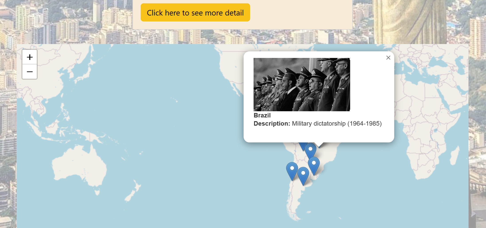

# South America Map Visualization Tool

## Overview
This project is a web-based visualization tool designed to explore various aspects of South American countries. It provides an interactive geographic map with brief information about each country and a detailed, zoomable burst view on a separate page for in-depth data.

## Features
* Interactive Map: Geographical map of South America with clickable countries.
* Overview Card: Insights into the cultural, historical, and natural aspects of each country.
* Tool Guide: Instructions for navigating the visualization features.
* Detailed Information Page: Zoomable burst view for detailed country-specific data.
## Usage
Open home.html to view the project's homepage with the geographical map.
Use the 'Click here to see more detail' button to navigate to the detailed information page.
